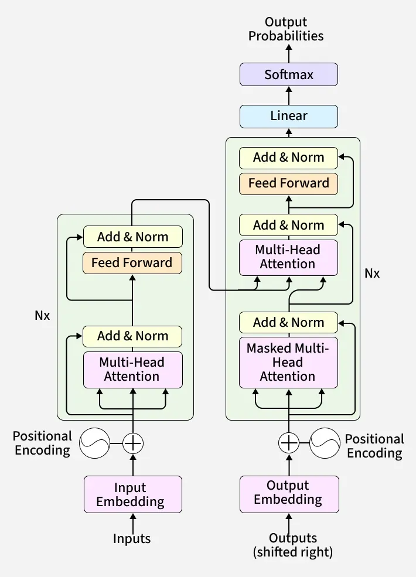
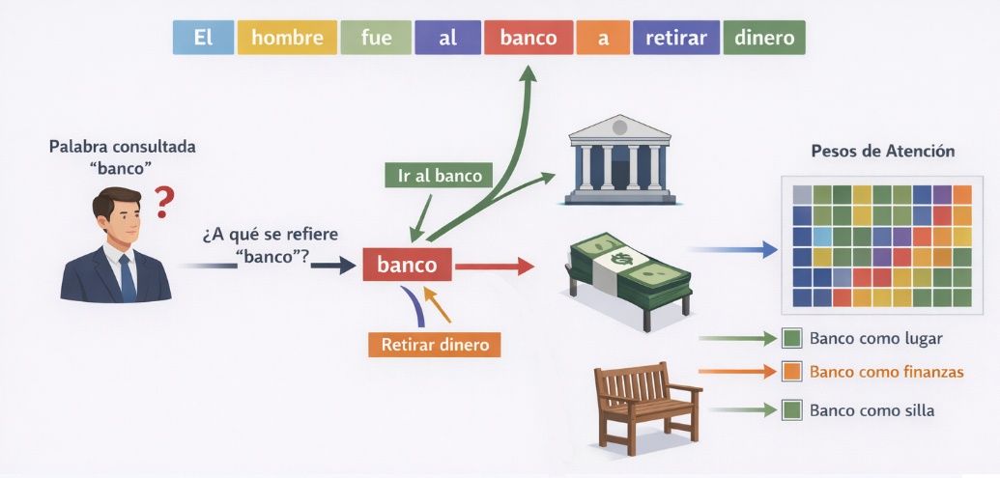
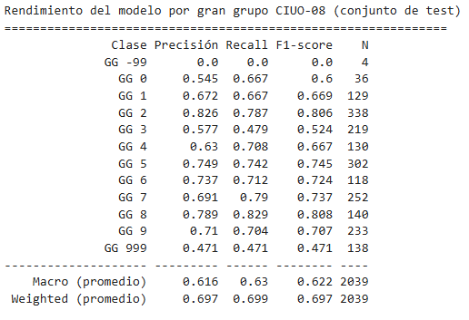

---
format:
  revealjs:
    auto-stretch: false
    margin: 0
    slide-number: true
    scrollable: true
    preview-links: auto
    page-layout: custom
    logo: imagenes/logo_portada2.png
    css: ine_quarto_styles.css
# jupyter: curso-cd-ia
# code-annotations: hover
editor: 
  markdown: 
    wrap: 72
---

```{python}
#| echo: false
#| output: false
import numpy as np
import pandas as pd
import matplotlib
import matplotlib.pyplot as plt
import warnings
warnings.filterwarnings('ignore')

import torch
import torch.nn as nn
import torch.nn.functional as F

matplotlib.rcParams['figure.dpi'] = 120

AZUL, NARANJA, VERDE, ROJO = "#1381B0", "#FF961C", "#2CA02C", "#D62728"

torch.manual_seed(42)
np.random.seed(42)
```

# 


[**Transformers y Fine-Tuning**]{.big-par .center-justified}

[**Junio 2026**]{.big-par .center-justified}

## Temario de hoy

::: {.medium-par .incremental}
El objetivo de esta clase es entender **cómo funcionan los
Transformers** y cómo usarlos a través de **fine-tuning** para resolver
problemas reales de procesamiento y análisis estadístico.

1.  **El problema que los transformers vinieron a resolver:** Límites de
    las RNN y LSTM, y la aparición del Transformer.
2.  **Mecanismo de atención:** La idea central de la arquitectura
3.  **Arquitectura Transformer:** Attention Head, Bloque transformer,
    Embeddings posicionales
4.  **Pre-entrenamiento y fine-tuning:** La lógica del transfer learning
5.  **Modelos para español:** BETO y la familia RoBERTa
6.  **Ejercicio práctico:** Fine-tuning de BETO con HuggingFace
:::

# El problema que los transformers vinieron a resolver

## Límites de las RNN y LSTM

::: {.fragment .medium-par}
Problema: el significado de una palabra depende de su contexto.
:::

::: fragment
> "Trabajo en una empresa que realiza **minería** de ..."
:::

::: fragment
En qué sector económico trabajo? La respuesta depende del contexto.

-   Minería de datos -\> Actividades profesionales, científicas y
    técnicas
-   Minería de cobre -\> Explotación de minas y canteras
:::

::: fragment
Hasta 2017, el estado del arte para solucionar este problema eran las
**Redes Neuronales Recurrentes (RNN)**, **Long Short-Term Memory
(LSTM)**, **Gated Recurent Units (GRU)**, entre otras.
:::

::: {.fragment .medium-par}
Pero tienen problemas:

-   La información **se diluye** a medida que la secuencia crece (Las
    LSTM mitigan el problema, pero no lo eliminan)
-   Recurrencia hace difícil la paralelización, por lo que el **costo
    computacional escala mal**.
:::

## La solución: Transformers y la Autoatención

::: {.fragment .medium-par}
En vez de leer de izquierda a derecha y acumular un estado latente, los
Transformers **miran todas las parte del texto** para entender qué dice
un texto, pero poniéndole más o menos atención a algunas partes.
:::

::: {.fragment .concepto-box}
Esa es la idea del mecanismo de **Atención (o Autoatención)**: en vez de
comprimir todo en un estado oculto, el modelo aprende a **ponderar
cuánto importa cada token** para producir la representación actual.
:::

## ¿Por qué son tan bacanes los Transformers?

::: fragment
**Paralelización masiva**: Los transformers procesan todos los tokens
simultáneamente, lo que significa que puedes aprovechar las GPUs al
máximo. Es lo que hizo posible entrenar modelos con billones de
parámetros.
:::

::: fragment
**Preentrenamiento:** Se pueden preentrenar en texto no supervisado
(predicción de siguiente token o tokens enmascarados) y luego afinar
para tareas específicas. Esta idea de "preentrenar una vez, usar muchas
veces" escaló de manera predecible: cuantos más datos y parámetros,
mejor el modelo.
:::

::: fragment
**Capacidades emergentes:** Arquitectura suficientemente flexible que
permite la aparición de capacidades emergentes, como el razonar en
múltiples pasos, hacer aritmética simple o aprender de pocos ejemplos en
el contexto.
:::

# El mecanismo de atención

## Intuición

:::: columns

::: {.column width=50%}

::: {.fragment .medium-par}
La atención es una parte de los Transformers. Es un mecanismo de
búsqueda aprendible (entrenable).
:::

::: {.fragment .medium-par}
Los transformers aprenden a qué y cómo poner atención para "entender"
los tokens de un texto.
:::

::: {.fragment .medium-par}
Esto permite actualizar la representación de cada token de un texto en
función de cuánta atención se le pone a las diferentes partes del mismo
texto.
:::

::: {.column width="50%"}
{width="350" height="500"}
:::

## Intuición

::: fragment
Para representar la palabra **banco**, el modelo mira las demás palabras
y le pone atención a las que son más "relevantes". En función de eso,
actualiza su valor (y así con todas los tokens del texto).
:::

{width="800"}

## Queries, Keys y Values

::: medium-par
La atención se implementa con tres matrices aprendibles. Para cada token
en la secuencia:
:::

::: {.incremental .medium-par}
-   **Query (Q)**: *"¿Qué información necesito?"* --- lo que estoy
    buscando.
-   **Key (K)**: *"¿Qué información tengo yo?"* --- lo que cada token
    ofrece.
-   **Value (V)**: *"¿Qué información entrego si me eligen?"* --- el
    contenido que se pasa.
:::

## Queries, Keys y Values

::: medium-par
La atención se implementa con tres matrices aprendibles. Para cada token
en la secuencia:
:::

::: medium-par
-   **Query (Q)**: *"¿Qué información me haría cambiar la forma en que
    entiendo un token?"*
-   **Key (K)**: *"¿Qué información es relevante para el significado de
    otros tokens?"*
-   **Value (V)**: *"¿Qué información traspaso a otros tokens, si es que
    me"eligen"?"*
:::

::: {.fragment .medium-par}
La atención entre Q y K produce un **peso** para cada par de tokens.
Esos pesos se aplican sobre V:

$$\text{Attention}(Q, K, V) = \text{softmax}\!\left(\frac{QK^\top}{\sqrt{d_k}}\right) V$$
:::

::: {.fragment .small-par}
El factor $\sqrt{d_k}$ escala los productos para evitar que el softmax
sature con valores muy grandes.
:::

# Arquitectura Transformer

## Atención multi-cabeza (Multi-Head Attention)

::: {.incremental .medium-par}
El mecanismo de atención corresponde a una "cabeza de atención" (junto a
otros componentes)
:::

::: medium-par
En la práctica, no se usa una sola cabeza de atención sino varias en
paralelo. Cada cabeza aprende a atender a **aspectos distintos** de la
secuencia:
:::

::: columns
::: {.column width="55%"}
::: {.incremental .medium-par}
-   Una cabeza puede capturar **relaciones sintácticas** (sujeto →
    verbo).
-   Otra puede capturar **relaciones semánticas** (ocupación → rama de
    actividad).
-   Otra puede rastrear **correferencias** (pronombres → sustantivos).
:::

::: {.fragment .medium-par}
Las salidas de todas las cabezas se concatenan y proyectan:

$$\text{MultiHead}(Q,K,V) = \text{Concat}(\text{head}_1, \ldots, \text{head}_h)\,W^O$$
:::
:::

::: {.column width="45%"}
<!--  -->
:::
:::

## El bloque Transformer

::: medium-par
Un bloque Transformer combina Multi-Head Attention con una red
feed-forward, rodeados de **normalización de capa** y **conexiones
residuales**:
:::

::: columns
::: {.column width="50%"}
::: {.incremental .medium-par}
1.  **Multi-Head Attention**: cada token atiende a todos los demás.
2.  **Add & Norm**: conexión residual + LayerNorm (estabiliza el
    entrenamiento).
3.  **Feed-Forward**: una red MLP pequeña aplicada posición a posición.
4.  **Add & Norm**: otra conexión residual.
:::

::: {.fragment .small-par}
Un Transformer completo = apilar $N$ de estos bloques (BERT usa 12 ó
24).
:::
:::

::: {.column width="50%"}
<!--  -->
:::
:::

## Visualizando un Transformer:

-   Recurso muy bueno para visualizar un transformer:

<https://poloclub.github.io/transformer-explainer/>

-   Charla en Youtube muy buena para entender y visualizar qué hace un
    Transformer

[Visualizing transformers and attention \| Talk for TNG Big Tech Day
'24](https://youtu.be/KJtZARuO3JY?si=RuD2RplooVP8Uwzt)

## Estructura Encoder-Decoder

::: fragment
El Transformer original (2017) se diseñó para traducción automática, por
lo que tenía dos mitades: Encoder y Decoder. La lógica era que el
Encoder "codificaba" la información de un idioma en un vector numérico,
y el Decoder tomaba esto y lo "decodificaba" en otro idioma.
:::

::: fragment
Con el tiempo se encontró que cada mitad es útil por separado, y para
propósitos diferentes.
:::

## Estructura Encoder-Decoder

::: fragment
**Encoder** - leer y representar

-   Toma una secuencia de tokens y produce una representación para cada
    uno

-   Atención bidireccional: cada token ve todos los demás (izquierda y
    derecha)

-   No genera nada: su salida son vectores, no palabras

-   Útil cuando la tarea requiere entender el texto de entrada
:::

::: fragment
**Decoder** - generar secuencias

-   Toma una secuencia de tokens y produce una predicción del siguiente
    token

-   Atención causal: cada token solo ve los anteriores, nunca los
    siguientes

-   Esta restricción es necesaria para que la generación sea coherente:
    no puede "hacer trampa" mirando el futuro

-   Útil cuando la tarea requiere producir texto nuevo
:::

## Modelos actuales (Claude, GPT-4, etc.)

Claude, GPT-4, Gemini y todos los grandes modelos de lenguaje actuales
son, en su núcleo, transformers decoder-only.

Entrenados con predicción de siguiente token sobre cantidades enormes de
texto, seguido de refinamiento con retroalimentación humana (RLHF o
variantes).

## BERT: el encoder por excelencia

::: {.incremental .medium-par}
**BERT** (*Bidirectional Encoder Representations from Transformers*,
Google 2018) fue el modelo que democratizó el uso de Transformers en
NLP:

-   12 capas Transformer, 110M de parámetros (versión base).
-   Pre-entrenado en Wikipedia + BooksCorpus en inglés.
-   Bidireccional: cada token ve **todo el contexto** (izquierda y
    derecha).
-   Tarea de pre-entrenamiento: **Masked Language Modeling** (MLM) y
    Next Sentence Prediction.
:::

::: {.fragment .nota-box}
Con BERT, por primera vez fue posible tomar un modelo ya entrenado y
adaptarlo a tareas específicas con muy pocos datos propios: el
**fine-tuning**.
:::

# Pre-entrenamiento y fine-tuning

## Fine-tuning

::: {.fragment .concepto-box}
Cuando queremos realizar una tarea con modelos de IA, no necesitamos
entrenar desde cero. Podemos partir de un modelo que ya "entiende" el
español y le enseñamos nuestra tarea específica, por lo que se necesitan
mucho menos datos de entrenamiento.
:::

::: {.fragment .medium-par}
El fine-tuning (o ajuste fino) es una técnica de inteligencia artificial
donde un modelo previamente entrenado recibe entrenamiento adicional con
un conjunto de datos más pequeño y específico. Esto permite adaptar sus
conocimientos generales para que realice tareas específicas.
:::

## ¿Qué ocurre durante el fine-tuning?

::: {.incremental .medium-par}
1.  Tomamos el modelo pre-entrenado (BERT, BETO...).
2.  Agregamos una **cabeza de clasificación**: una capa lineal sobre el
    token `[CLS]`.
3.  Entrenamos con nuestros datos etiquetados, ajustando **todos los
    pesos** (o solo parte de ellos).
4.  Usamos un learning rate muy pequeño para no "olvidar" lo
    pre-entrenado.
:::

::: {.incremental .callout-note .small-callout}
El token `[CLS]` es un token especial que BERT agrega al inicio de cada
texto. Su representación final captura el significado global de la
oración y se usa como input para la capa de clasificación.
:::

# Modelos para español

## El problema del idioma

::: {.incremental .medium-par}
BERT fue pre-entrenado en inglés. Usarlo directamente para texto en
español tiene limitaciones:

-   El vocabulario (tokenizador) fue construido para inglés.
-   Palabras en español se fragmentan en muchos tokens: *"electricista"*
    → `["el", "##ect", "##ric", "##ista"]`.
-   El modelo "entiende" menos del español que del inglés.
:::

::: {.fragment .concepto-box}
La solución: modelos pre-entrenados **directamente en español**.
:::

## BETO: BERT para español

::: {.incremental .medium-par}
**BETO** es la versión de BERT entrenada por el Departamento de Ciencias
de la Computación de la Universidad de Chile:

-   Pre-entrenado en el **Spanish Wikipedia** (más de 3 GB de texto).
-   Mismo vocabulario y arquitectura que BERT-base (30.000 tokens en
    español).
-   Publicado en HuggingFace como
    `dccuchile/bert-base-spanish-wwm-cased`.
:::

## Otros modelos relevantes

::: medium-par
| Modelo          | Base    | Entrenado en          | HuggingFace                             |
|------------------|------------------|------------------|------------------|
| **BETO**        | BERT    | Wikipedia ES          | `dccuchile/bert-base-spanish-wwm-cased` |
| **RoBERTa-es**  | RoBERTa | 0.9 TB texto español  | `PlanTL-GOB-ES/roberta-base-bne`        |
| **mBERT**       | BERT    | Wikipedia 104 idiomas | `bert-base-multilingual-cased`          |
| **XLM-RoBERTa** | RoBERTa | 100 idiomas           | `xlm-roberta-base`                      |
:::

::: {.fragment .medium-par}
**¿Cuál elegir?** Para glosas de ocupación y actividad económica en
Chile:

-   **BETO** es una excelente línea base, fácil de usar y bien
    documentada.
-   **RoBERTa-es (BNE)** suele superar a BETO en benchmarks; entrenado
    con corpus más diverso.
-   **XLM-RoBERTa** útil si el corpus tiene mezcla de idiomas o
    dialectos.
:::

# Ejercicio práctico

## El problema de la codificación

::: {.incremental .medium-par}
En el Censo 2024, las preguntas de **ocupación** y **rama de actividad**
se capturan como texto libre:

-   *"¿Cuál es su ocupación principal?"* → "Técnico electricista"
-   *"¿Qué tareas y deberes cumple en su trabajo?"* → "Instalar sistemas
    eléctricos"
-   *"¿A qué se dedica la empresa en la cual trabaja?"* → "Construcción
    de edificios"

Estas respuestas deben codificarse según clasificadores internacionales:

-   **CIUO-08**: Clasificación Internacional Uniforme de Ocupaciones
    (OIT)
-   **CAENES**: Clasificación de Actividades Económicas para Encuestas
    Sociodemográficas (INE)
:::

::: {.fragment .nota-box}
La codificación manual es costosa y propensa a inconsistencias entre
codificadores. Un modelo de fine-tuning puede automatizar el proceso y
mejorar la consistencia.
:::

## Codificación de ocupaciones (CIUO-08)

::: medium-par
**Entrada**: texto libre de la glosa de ocupación, y de tareas y
deberes.

**Salida**: código CIUO-08 a 1 dígito (10 grandes grupos).
:::

::: medium-par
| Código | Grupo                                     |
|--------|-------------------------------------------|
| 1      | Directores y gerentes                     |
| 2      | Profesionales científicos e intelectuales |
| 3      | Técnicos y profesionales de nivel medio   |
| 4      | Personal de apoyo administrativo          |
| ...    | ...                                       |
| 9      | Ocupaciones elementales                   |
:::

::: {.fragment .callout-note .small-callout}
Ejericio práctico con 1 dígito (10 clases) como primer paso. El modelo
puede refinarse luego para 2, 3 y 4 dígitos, donde el problema se vuelve
más difícil.
:::

## Pipeline completo con HuggingFace

::: medium-par
HuggingFace `transformers` permite hacer fine-tuning de BETO en pocas
líneas. El pipeline completo tiene cinco etapas:
:::

::: {.incremental .medium-par}
1.  **Carga y preparación de datos**
2.  **Codificación de etiquetas y split train/test**
3.  **Tokenización**
4.  **Configurar el Trainer y entrenar**
5.  **Evaluación e inferencia**
:::

::: {.fragment .nota-box}
Usaremos un dataset de glosas auditadas por el equipo de Nomenclaturas,
proveniente de distintas encuestas o Censos realizados por el INE, con
etiquetas CIUO-08 a 1 dígito.
:::

## Paso 1: carga de datos

```{python}
#| echo: true
#| eval: false
import pandas as pd
import numpy as np
from sklearn.model_selection import train_test_split
from sklearn.preprocessing import LabelEncoder
from sklearn.metrics import classification_report, accuracy_score, f1_score

df = pd.read_csv("codigos_ciuo_auditorias_nomenclaturas.csv")
df = df[["texto", "codigo_ciuo_1d"]].dropna().reset_index(drop=True) # <1>

print(f"Total de registros: {len(df):,}")
print(df["codigo_ciuo_1d"].value_counts().sort_index())
```

1.  `texto` es la concatenación de ocupación y tareas. Usar ambos campos
    mejora la clasificación porque el modelo dispone de más contexto que
    solo el nombre del cargo.

## Paso 2: codificación de etiquetas y split

```{python}
#| echo: true
#| eval: false
le = LabelEncoder()                                    # <1>
df["label"] = le.fit_transform(df["codigo_ciuo_1d"])

train_df, test_df = train_test_split(
    df,
    test_size=0.2,
    random_state=42,
    stratify=df["label"]                               # <2>
)
print(f"Entrenamiento: {len(train_df):,}  |  Test: {len(test_df):,}")
```

1.  PyTorch necesita enteros contiguos desde 0. `LabelEncoder` hace ese
    mapeo automáticamente: si en los datos solo aparecen los grupos 1,
    2, 3 y 5, los convierte a 0, 1, 2, 3. El objeto `le` guarda el mapeo
    inverso para recuperar los códigos CIUO originales al final.
2.  `stratify` garantiza que la proporción de cada grupo CIUO sea la
    misma en train y test, lo que es importante cuando hay clases con
    pocos ejemplos.

## Paso 3: tokenización

```{python}
#| echo: true
#| eval: false
from transformers import AutoTokenizer
from datasets import Dataset

MODEL = "dccuchile/bert-base-spanish-wwm-cased"
tokenizer = AutoTokenizer.from_pretrained(MODEL)

def tokenize(batch):
    return tokenizer(
        batch["texto"],
        truncation=True,
        padding="max_length",
        max_length=64           # <1>
    )

ds_train = Dataset.from_pandas(train_df[["texto", "label"]].reset_index(drop=True))
ds_test  = Dataset.from_pandas(test_df[["texto", "label"]].reset_index(drop=True))

ds_train = ds_train.map(tokenize, batched=True)
ds_test  = ds_test.map(tokenize, batched=True)

ds_train.set_format(type="torch", columns=["input_ids", "attention_mask", "label"]) # <2>
ds_test.set_format(type="torch",  columns=["input_ids", "attention_mask", "label"])
```

1.  64 tokens es suficiente para glosas cortas de ocupación y ahorra
    memoria en GPU.
2.  Sin `set_format`, el `Trainer` puede fallar al intentar armar los
    batches: los tensores de PyTorch deben ser explícitamente del tipo
    correcto.

## Paso 4: modelo

```{python}
#| echo: true
#| eval: false
from transformers import AutoModelForSequenceClassification, Trainer, TrainingArguments

model = AutoModelForSequenceClassification.from_pretrained(  # <1>
    MODEL, num_labels=df["label"].nunique()
)

def compute_metrics(eval_pred):
    logits, labels = eval_pred
    preds = np.argmax(logits, axis=-1)
    return {
        "accuracy":    round(accuracy_score(labels, preds), 4),
        "f1_macro":    round(f1_score(labels, preds, average="macro",    zero_division=0), 4), # <2>
        "f1_weighted": round(f1_score(labels, preds, average="weighted", zero_division=0), 4),
    }

trainer = Trainer(
    model=model,
    args=TrainingArguments(
        output_dir="./modelo_ciuo08",
        num_train_epochs=3,
        per_device_train_batch_size=32,
        learning_rate=2e-5,             # <3>
        eval_strategy="epoch",
        logging_strategy="epoch",
        report_to="none",               # <4>
        save_strategy="no",
    ),
    train_dataset=ds_train,
    eval_dataset=ds_test,
    compute_metrics=compute_metrics,
)
trainer.train()
```

1.  Al cargar el modelo verán avisos sobre pesos no utilizados (los de
    MLM) y pesos faltantes (la cabeza de clasificación). Ambos son
    normales.
2.  F1 macro pondera cada clase por igual, independiente de su tamaño.
    Es más informativo que la accuracy cuando las clases están
    desbalanceadas.
3.  Learning rate entre 2e-5 y 5e-5 es estándar para fine-tuning de
    BERT.

## Paso 5: evaluación detallada

```{python}
#| echo: true
#| eval: false
from sklearn.metrics import classification_report

salida = trainer.predict(ds_test)
preds  = np.argmax(salida.predictions, axis=-1)
etiquetas_reales = np.array(ds_test["label"])

nombres_clases = [f"GG {c}" for c in le.classes_]  # <1>

reporte = classification_report(
    etiquetas_reales, preds,
    target_names=nombres_clases,
    zero_division=0
)
print(reporte)
```

1.  `le.classes_` contiene los códigos CIUO originales en el orden en
    que `LabelEncoder` los asignó. Así cada fila del reporte muestra el
    gran grupo CIUO real, no un índice interno.

::: {.fragment .callout-note .small-callout}
El reporte muestra precisión, recall y F1 **por cada gran grupo CIUO**.
Es la métrica más útil para detectar qué grupos son difíciles de
clasificar (p/e Grupo 5 Servicios vs. Grupo 9 Ocupaciones elementales
suelen confundirse).
:::

## Paso 6: inferencia con decodificación real

```{python}
#| echo: true
#| eval: false
from transformers import pipeline

DIRECTORIO_FINAL = "./modelo_ciuo08/final"
trainer.save_model(DIRECTORIO_FINAL)
tokenizer.save_pretrained(DIRECTORIO_FINAL)

clasificador = pipeline("text-classification", model=DIRECTORIO_FINAL,
                        tokenizer=DIRECTORIO_FINAL, device=-1)

def predecir_ciuo(texto):
    resultado = clasificador(texto, truncation=True, max_length=64)[0]
    idx     = int(resultado["label"].split("_")[1])  # <1>
    codigo  = le.classes_[idx]
    return {"codigo_ciuo_1d": int(codigo), "confianza": round(resultado["score"], 4)}

glosas = [
    "OCUPACIÓN: ENFERMERA; TAREA: ADMINISTRAR MEDICAMENTOS Y CONTROLAR SIGNOS VITALES",
    "OCUPACIÓN: CONDUCTOR DE CAMIÓN; TAREA: TRANSPORTAR CARGA ENTRE REGIONES",
    "OCUPACIÓN: TEMPORERO AGRÍCOLA; TAREA: COSECHAR UVA EN TEMPORADA",
]
for glosa in glosas:
    r = predecir_ciuo(glosa)
    print(f"GG {r['codigo_ciuo_1d']}  ({r['confianza']:.1%})  →  {glosa[:65]}")
```

1.  `pipeline` devuelve `"LABEL_0"`, `"LABEL_1"`, etc. --- índices
    internos, no códigos CIUO. `le.classes_[idx]` recupera el código
    CIUO original a partir de ese índice.

## Resultados

::: medium-par
Con el dataset de auditorías de Nomenclaturas (\~10.000 glosas):
:::

{width="350" height="500"}


# Cierre

## Qué vimos hoy

::: {.incremental .medium-par}
1.  **El problema de las RNN**: pérdida de memoria en secuencias largas,
    dificultad para paralelizar.
2.  **Mecanismo de atención**: Q, K, V --- cada token puede mirar
    directamente cualquier otro.
3.  **Arquitectura Transformer**: bloques de Multi-Head Attention +
    Feed-Forward + residuales.
4.  **Encoder vs. Decoder**: para clasificación censal, usamos encoders
    (BERT/BETO).
5.  **Pre-entrenamiento + fine-tuning**: aprovechamos conocimiento
    general para adaptarlo a CIUO/CAENES.
6.  **BETO y el ecosistema HuggingFace**: pipeline completo en Python.
7.  **Aplicaciones en CPV2024**: codificación automática de ocupaciones
    (CIUO-08) y rama de actividad (CAENES).
:::

# Gracias
